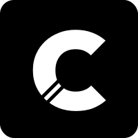

<p align="center">
 
</p>

# Celestria 🔮


[](https://vercel.com)


**Celestria** is an elegant **Next.js** application designed to generate, customize, and share beautiful code snippets. With support for multiple programming languages, themes, and export options, Celestria makes sharing code both functional and visually stunning.

---

## Features ⚡

- **Code Snippet Generation**: Create beautiful, syntax-highlighted code snippets for over 20 programming languages
- **Custom Themes**: Choose from a variety of pre-built themes or create your own
- **Export Options**: Download as PNG
- **Responsive Design**: Works seamlessly across desktop and mobile devices
- **Next.js App Router**: Built with the latest Next.js features
- **TypeScript**: Fully typed for better maintainability
- **Tailwind CSS**: Beautifully styled with extensive customization
- **Dark/Light Mode**: Supports system preferences and manual toggle

---

## Getting Started 🚀

### Prerequisites

Ensure you have the following installed:

- **Node.js**: v22 or later

---

### Installation ⚙️

1. Clone the repository:

   ```bash
   git clone https://github.com/tejastn10/celestria.git
   cd celestria
   ```

2. Install dependencies:

   ```bash
   npm install
   ```

3. Start the development server:

   ```bash
   npm run dev
   ```

4. Open `http://localhost:3000` in your browser to to start creating code snippets.

---

## Project Structure 📂

```bash
celestria/
├── public/                # Static assets
├── src/
│ ├── app/                 # Next.js App Router pages
│ ├── components/          # Reusable UI components
│ │ ├── editor/            # Code editor components
│ │ ├── ui/                # Generic UI components
│ ├── lib/                 # Utility functions and services
│ │ ├── store              # State management
│ ├── styles/              # Global styles
│ ├── types/               # TypeScript type definitions
├── biome.json             # Biome configuration
├── next.config.js         # Next.js configuration
├── tailwind.config.js     # Tailwind CSS configuration
├── tsconfig.json          # TypeScript configuration
├── package.json           # Dependencies and scripts
└── README.md              # This documentation
```

---

## Usage 🖥️

1. **Create a Snippet**: Enter your code in the editor
2. **Customize**: Select language, theme, and styling options
3. **Export**: Download as image

---

## Advanced Features 🔧

- **Custom Themes**: Create and save your own color themes
- **Embeddable Snippets**: Embed your snippets in blogs or documentation

---

## License 📜

This project is licensed under the MIT License. See the [LICENSE](LICENSE.md) file for details.

---

## Acknowledgments 🙌

- Built with **Next.js** and **Tailwind CSS**
- Inspired by the beauty of the cosmos, where each snippet is a star in your coding universe
- Created with ❤️ to make code sharing both functional and beautiful
